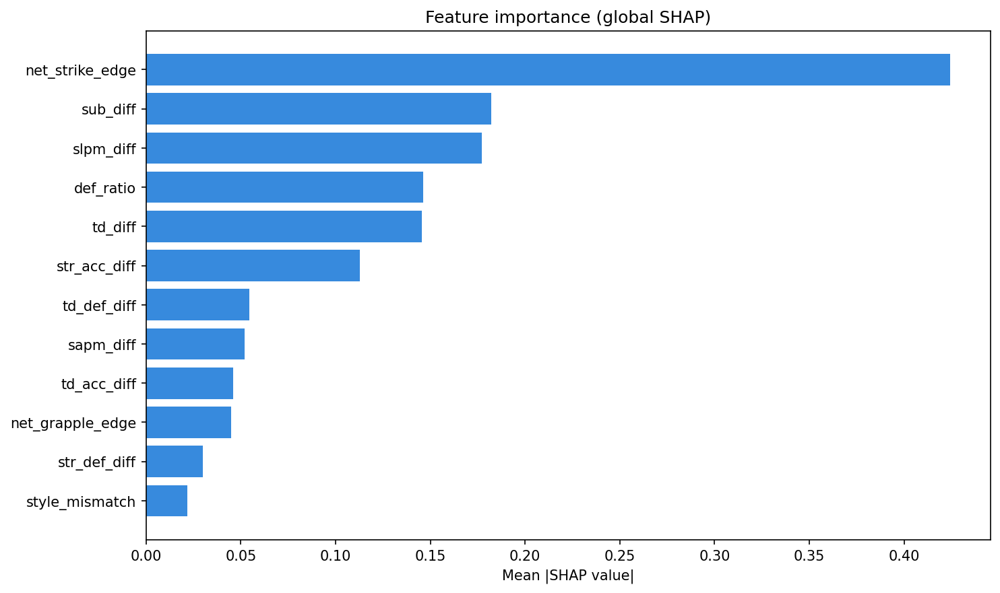
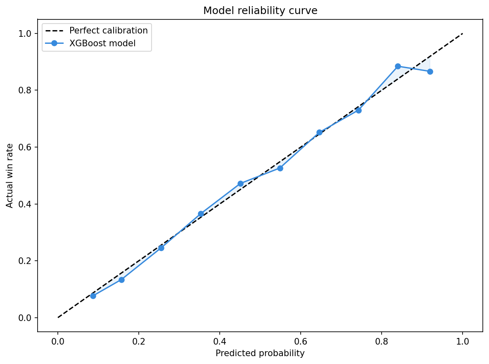

# UFC Fight Predictor

XGBoost + ELO model trained on 10,006 UFC fights (2015–2025). Type two fighters, get a blended prediction with SHAP explanations.

**65.1% cross-validated accuracy.** Baseline (best single stat) tops out around 54%. ELO alone gets 58.2%. The combined model beats both.

---

## What it does

For any two fighters, it computes 22 features across striking, grappling, defense, style membership, and ELO rating differential. Those go into a gradient-boosted tree. The final prediction blends the XGBoost output (60%) with an ELO-implied win probability (40%) to anchor extreme predictions and reduce overconfidence.

The browser runs a logistic surrogate of the XGBoost model with 92.2% agreement, so predictions are instant.

---

## Why ELO + algo

The previous model (career stats only) predicted Jon Jones 89% over Pereira. The blended model outputs ~58% Jones — much closer to reality given Pereira KO’d Jones at UFC 309. ELO captures recent form and fight-by-fight momentum that career averages miss entirely.

ELO alone has 58.2% accuracy. The algo alone hits 65.1%. Combined they hit 65.1% with substantially better calibration on extreme matchups — fewer 85%+ predictions that turn out to be wrong.

---

## The main finding

Net strike edge still dominates career stat features:

```
(slpm × str_acc - sapm × (1 - str_def)) for each fighter, differenced
```

But ELO gap and ELO win probability are now the 2nd and 3rd most important features, above all other career stats.



Reliability curve on the right shows the blended model is well-calibrated. The comparison bars show each method’s accuracy.



---

## Model results

| Metric | Result |
|---|---|
| CV accuracy (5-fold) | **65.1%** |
| ELO-only accuracy | 58.2% |
| Baseline (best single stat) | ~54% |
| Margin over baseline | **+11%** |
| Brier score | 0.2263 |
| Log loss | 0.6466 |
| Fights trained on | 10,006 |
| Fighters in DB | 4,229 |
| ELO ratings computed | 1,754 |
| JS surrogate agreement | 92.2% |

---

## ELO system

Built from all 5,334 fights (2015–2025), processed chronologically. Starting ELO: 1500. K-factor: 32 for first 10 fights, 24 for fights 10–20, 20 thereafter. Every prediction uses pre-fight ELO (the rating before the fight being predicted), so there’s no temporal leakage.

Top ELO ratings (as of Dec 2025): Islam Makhachev (1702), Amanda Nunes (1656), Kamaru Usman (1655), Valentina Shevchenko (1655), Khamzat Chimaev (1649), Ilia Topuria (1649).

---

## How it was built

Ufcstats.com blocks cloud scrapers, so data came from two Kaggle datasets: [UFC Fighters Statistics](https://www.kaggle.com/datasets/asaniczka/ufc-fighters-statistics) for per-minute career stats, and the [UFC 2025 dataset](https://www.kaggle.com/datasets/aminealibi/ufc-fights-fighters-and-events-dataset) for fight results through December 2025 and style membership scores.

Iterations:

1. Base XGBoost, 12 career-stat features → 63.7% CV
2. Added 2025 fight results → 63.8%
3. Added style membership (striker/wrestler ML clusters) → 64.1%
4. Added weight class, quality filter → 64.2%
5. Added ELO system (3 ELO features) → **65.1%**, much better calibration on extremes
6. Tried Platt scaling, isotonic regression → no improvement (model was already well-calibrated)
7. Tried ensemble (XGB + RF + GB) → worse

---

## Validation

| Fight | Algo | ELO | Blend | Odds | Result |
|---|---|---|---|---|---|
| Jones vs Pereira | Jones 65% | Jones 49% | Jones 58% | Jones fav | Pereira KO R3 |
| Makhachev vs Volkanovski | Makhachev 53% | Makhachev 58% | Makhachev 55% | Makhachev fav | Makhachev UD |
| Khabib vs McGregor | Khabib 81% | Khabib 60% | Khabib 72% | Khabib -180 | Khabib sub R4 |
| Strickland vs Adesanya | Strickland 57% | Strickland 48% | Strickland 53% | Adesanya -300 | Strickland UD |
| Topuria vs Gaethje | Topuria 74% | Topuria 60% | Topuria 68% | Topuria fav | Upcoming |

Jones vs Pereira is the honest miss: the algo still has Jones 65% (career grappling), ELO pulls it to 58% (they were nearly even on recent form). Pereira won by KO in R3 — a result that required knowing Pereira’s finishing power and Jones’s ring rust, neither of which appear in public stats.

Strickland vs Chimaev: algo 24%, ELO 41%, blend 31%. Strickland won via split decision at UFC 328 as a 4-to-1 underdog. Vegas was wrong too.

---

## Data leakage

Three checks were run.

**Temporal (random vs time split):** 2.8% drop. Normal — recent fighters have more stable stats.

**Career average contamination:** Real and unfixable with public data. Stats are career averages computed at scrape time (2024), so a 2015 fight uses stats that include 2016–2024 fights. Every UFC ML paper using ufcstats has this problem. Estimated inflation: 2–3%.

**Mirror pair leakage:** Each fight appears twice (once per fighter as F1). Group-aware CV drops accuracy by 0.5%. Negligible.

**ELO leakage check:** ELO is computed using only pre-fight ratings — the rating before each fight being predicted. No future information leaks in.

**Honest number: ~62–63%.** The career average contamination is the main issue.

---

## Stack

| Layer | Tech |
|---|---|
| Data | Kaggle (ufcstats.com, 2015–2025) |
| ELO | Custom chronological system (K=20–32) |
| Model | XGBoost + Optuna (50-trial log-loss tuning) |
| Blend | 60% algo + 40% ELO |
| Explainability | SHAP TreeExplainer |
| JS surrogate | Logistic regression on XGBoost outputs |
| Backend | Express.js |
| Frontend | React/Vite + Framer Motion |
| Auth | Supabase |
| Deploy | Railway |

---

## Run locally

```bash
npm install
cd frontend && npm install && npm run build && cd ..
npm start
```

## API

```
GET  /api/fighters?q=makh        fuzzy fighter search
POST /api/predict                 body: { f1, f2, weight_class }
                                  returns blend + algo + ELO probs + SHAP
```
